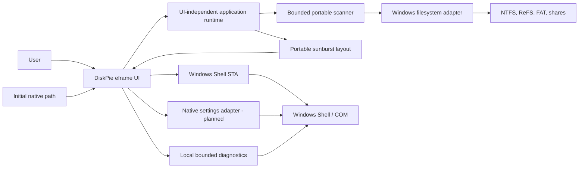
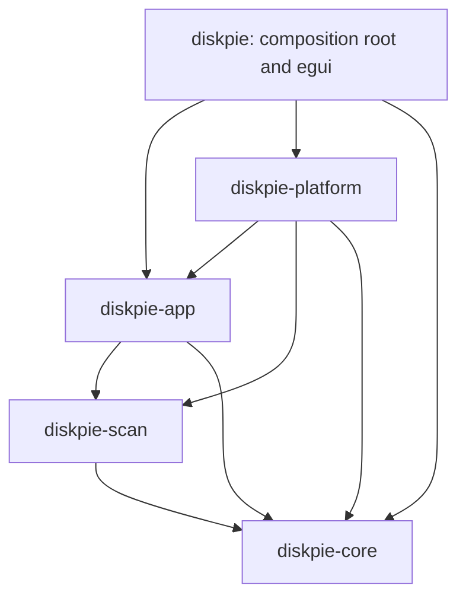
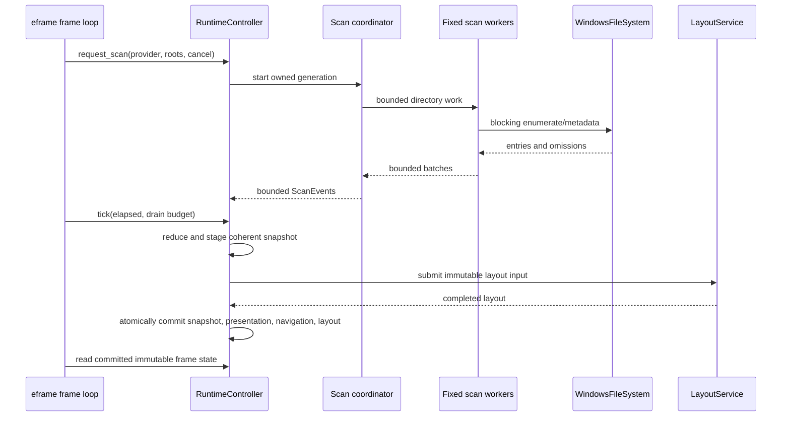
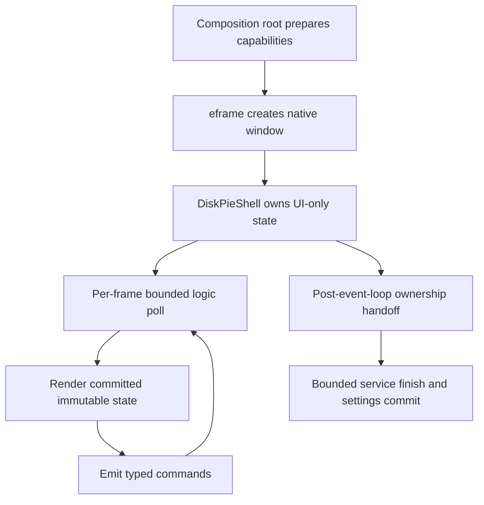
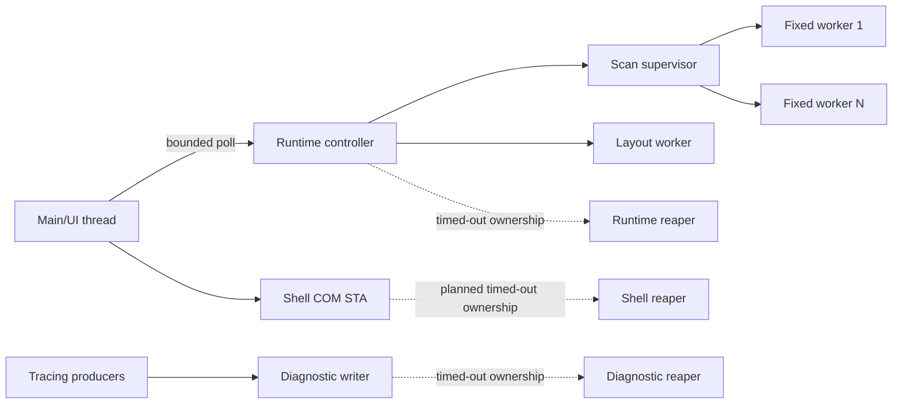

# DiskPie architecture

> Living architecture guide and continuation context. Last reconciled with the
> paused dirty working tree on 2026-08-02. Statements labeled **planned** are
> required direction, not implemented behavior.

## 1. Architectural goals

DiskPie must scan very large directory trees without freezing the UI, preserve
Windows-native path identity, stream coherent partial results, cancel promptly,
render a navigable sunburst, and isolate destructive Windows operations behind
explicit confirmation. The first distribution target is a portable Windows
10/11 x86-64 executable that runs as a standard user.

The design optimizes for explicit bounded ownership rather than an async
runtime, task-per-file traversal, UI-owned I/O, or a broad framework. Every
queue, worker set, retained diagnostic, history, and background retirement path
must have a documented bound.

## 2. System context



Core rule: arrows from the UI to platform services represent nonblocking
submission or composition-root lifecycle calls. The egui callback never waits
for filesystem, COM, layout, settings, diagnostics, or provider teardown.

## 3. Workspace dependency graph

The workspace is an acyclic modular monolith:



No reverse dependency is permitted without a superseding ADR.

### `diskpie-core`

Portable, UI-independent domain code:

- checked compact `NodeId` values and immutable `TreeSnapshot` revisions;
- native component names and lazy full-path reconstruction;
- logical and allocated metric types, unknown reasons, and aggregation;
- hard-link accounting inputs and file identity;
- deterministic sunburst sectors, synthetic `Other`/hidden sectors, layout, and
  polar hit testing.

It must not depend on egui, eframe, Windows APIs, or filesystem traversal.

Primary files: `crates/diskpie-core/src/model.rs` and
`crates/diskpie-core/src/sunburst.rs`.

### `diskpie-scan`

Portable blocking-scan orchestration:

- `ScanFs` is the narrow filesystem-consumer trait;
- `ScanRoot` carries a native root path, volume key, and storage class;
- one coordinator owns pending directories, ordering, permits, and progress;
- a fixed worker set receives capacity-one work items;
- bounded result and event channels provide backpressure;
- `CancelToken` and scan generations reject stale work;
- batches stream partial results and typed omissions.

The scanner never creates one task per file and never mutates UI state.

Primary files: `crates/diskpie-scan/src/fs.rs`, `protocol.rs`, and
`coordinator.rs`.

### `diskpie-app`

UI-independent application policy and orchestration:

- `SessionReducer` applies scan events and publishes coherent snapshots;
- `RuntimeController` owns active/pending/retiring scans and frame-bounded
  polling;
- `LayoutService` computes layouts off the frame thread;
- `NavigationState` owns selection, zoom root, Back history, hidden branches,
  size basis, and rescan intent;
- presentation indexes provide stable textual/chart-facing state;
- settings policy parses, migrates, validates, stages, and reports bounded RON;
- diagnostics define typed path-free events, redaction, and bounded export.

This crate may own traits implemented by the platform, but it must not name COM,
Win32, HWND, egui, or eframe types.

Primary files: `runtime.rs`, `session.rs`, `navigation.rs`,
`layout_service.rs`, `presentation.rs`, `settings.rs`, and `diagnostics/`.

### `diskpie-platform`

Target-gated operating-system adapters and the only normal home for
project-authored unsafe code:

- `filesystem.rs`: Win32 directory enumeration and metadata;
- `volumes.rs`: volume discovery, device hints, capacity, and root resolution;
- `shell_service.rs`: one message-pumping COM STA and folder dialog;
- `project_paths.rs`: Known Folder-based application directories;
- `diagnostic_files.rs`: retained-handle local logging, retention, export, and
  atomic marker support; and
- **planned** `settings_file.rs`: explicit retained-handle `app.ron` transport.

Every unsafe block must be target-gated, minimal, documented with a `SAFETY`
invariant, and convert raw ownership to RAII immediately.

### `diskpie`

Executable and composition root:

- CLI parsing and native startup path;
- eframe lifecycle and dependency construction;
- responsive UI, theme, localization, and chart mesh adapter;
- polling platform/runtime events within frame budgets;
- local diagnostic subscriber lifecycle;
- settings/crash capability preparation and post-event-loop finish; and
- **planned** destructive confirmation surfaces.

The crate forbids unsafe code. Native filesystem and COM work belongs in the
platform crate.

## 4. Scan-to-frame data flow



Important invariants:

- Only the coordinator schedules directory work.
- Workers never recursively enqueue more workers.
- Every event carries a generation; stale events cannot mutate a newer scan.
- The frame loop uses `try_recv`/bounded drains and never waits.
- A new snapshot is visible only when snapshot, presentation, navigation, and
  layout correspond to the same committed revision.
- Progressive snapshots are rate-limited so layout cannot starve scanning or
  repaint continuously while idle.

## 5. Runtime ownership model

`RuntimeController` is the application-level owner of scan lifecycle:

- `Idle`: no active or settled session;
- `Active`: one generation is reducing events;
- `Cancelling`: the active generation is invalidated and an optional one-slot
  replacement is pending;
- `Settled`: terminal results and summary remain inspectable;
- `ShuttingDown`: cancellation and retirement have begun; and
- `ShutdownComplete`: runtime ownership has been handed off, although an
  underlying provider may still be returning from a blocking OS call.

Rejected launches preserve ownership. Callers recover the exact provider,
roots, and token from `ScanLaunchRejected::into_parts`; rejection must never
silently consume or leak them.

Retirement uses a process-wide bounded reaper. Its intended accounting is:

```text
available ordinary slots + active disposal + queued payloads + reserved teardown slot = 65
```

There are at most 64 ordinary retiring payloads. The 65th slot is reserved for
runtime teardown so dropping the application remains bounded even under
ordinary retirement saturation. Capacity remains occupied until disposal has
actually returned, including through a caught panic.

The latest implementation passed focused/stress checks but its final
independent revalidation was interrupted by the project pause. Treat it as
implemented, not yet accepted.

## 6. Model and filesystem semantics

### Native paths

Filesystem identity uses `Path`, `PathBuf`, `OsStr`, and `OsString`. Display may
be lossy and escaped, but a display string must never be converted back into an
action path. Windows adapters convert absolute DOS/UNC paths to extended-length
forms and preserve non-scalar UTF-16 where APIs allow it.

### Size model

Each node distinguishes:

- logical size (end-of-file content length);
- allocated size (storage actually allocated by the filesystem);
- source/precision; and
- unknown reason.

Unknown is not zero. UI proportions use the selected size basis; details show
both. Totals use checked wide accumulation before any display conversion.

### Hard links

Hard-link deduplication is scoped to a volume and based on stable file identity.
The first observed identity contributes allocation according to ADR 0002;
subsequent links do not double-count allocated storage. Logical naming remains
visible for each directory entry. When identity is unavailable, precision is
reported rather than silently claiming exact deduplication.

### Boundaries and omissions

By default, DiskPie does not traverse reparse points, symlinks, junctions,
mount points, or cloud boundaries that could loop, escape the selected tree,
cross a volume, or hydrate content. The adapter returns a visible omission or
boundary record. Access denied and isolated I/O failures also become omissions;
they do not abort unrelated branches.

Sparse and compressed allocation is read from filesystem metadata. Remote,
removable, and unknown devices use conservative scheduling classes.

## 7. Navigation and presentation

`NavigationState` is pure and generation-sealed. It separates:

- the chart's current `view_root`;
- the selected real node;
- bounded Back history;
- size basis;
- explicitly hidden branches; and
- rescan requests.

Commands are typed (`Select`, `Activate`, `Zoom`, `Back`, `Parent`,
`ShowSummary`, hide/restore, size-basis change, full/branch rescan). Availability
is computed before execution and stale-generation commands fail without partial
mutation.

When a progressive or rescan snapshot replaces the current one, anchors resolve
by file identity first, exact native path second, and deepest surviving real
ancestor where appropriate. Hidden deleted children do not cause an ancestor to
be hidden accidentally.

Hidden-branch edits use a persistent plan with a strict maximum delta depth of
64. Lookups visit at most 65 nodes. A caller-frame rebase swaps to a cached base
in O(1); if the cache is not ready, mutation returns `HiddenStateBusy` rather
than materializing an unbounded set on the UI thread.

## 8. Sunburst architecture

The portable layout engine produces immutable backend-neutral sectors. Sectors
may represent:

- a real actionable node;
- a synthetic multi-root summary;
- aggregated `Other` children; or
- aggregated hidden members.

Only a real sector exposes an action target. Synthetic sectors cannot be used
for filesystem mutations.

`crates/diskpie/src/sunburst_view.rs` converts a committed layout into cached
egui meshes, performs pointer/keyboard interaction mapping, and returns typed
requests to application state. Hovering does not rebuild geometry. The intended
connected view is paired with a synchronized textual list so every chart action
has a keyboard-accessible equivalent.

## 9. UI composition

The current `DiskPieShell` is a visual scaffold, not a connected product. It
implements the original “forensic radial instrument” direction, responsive
wide/narrow rails, theme/locale controls, and settings synchronization, but its
chart is calibration art and actions are disabled.

The planned composition is:



The shell needs a safe owner HWND for native modal operations, but must not own
COM objects. Path/volume resolution and `WindowsFileSystem` construction occur
off the frame callback. The logic phase supplies elapsed `Duration` to the
runtime, drains bounded events, and requests repaint only while needed.

Required responsive surfaces:

- command rail: Back, Parent, choose roots, rescan, cancel, theme, language;
- telemetry rail: phase, progress, counts, selected size, omissions, metric;
- radial lens: actual `SunburstView`;
- inspection rail/list: largest children, selection details, keyboard actions;
- status rail: errors/warnings without paths in diagnostic records; and
- modal confirmation flows for destructive actions.

See [UI product direction](research/ui-product-direction.md) for typography,
palette, accessibility, motion, and frame-performance constraints.

## 10. Windows platform services

### Filesystem and volumes

`WindowsFileSystem` uses direct Win32 enumeration and metadata calls. It has
optional direct cancellation checkpoints and is passed the same token used by
the scan coordinator. `resolve_scan_root` turns a selected absolute path into a
portable `ScanRoot` plus volume/device evidence. This resolution is blocking and
must not run in an egui callback.

### Shell STA

`ShellService` owns one dedicated, message-pumping single-threaded COM
apartment. Requests/events crossing the channel are owned plain data; COM
interfaces and PIDLs never leave the STA. The current implementation supports a
filesystem-only folder picker with a real owner HWND and one outstanding modal
request.

Known gap: `Drop` currently calls a synchronous join. Before UI integration,
add nonblocking shutdown request, bounded explicit finish, and a process-wide
bounded reaper that retains both the join handle and singleton claim until the
worker truly exits.

### Destructive actions - planned

Open, recycle, permanent delete, empty recycle bin, and Installed Apps requests
will extend the same STA behind a UI-independent action port. A pure confirmation
state machine binds an exact immutable native target and scan generation before
the platform sees a mutation request. Permanent deletion has a stronger visual
confirmation than recycling.

### Explorer integration - planned

Optional integration is per-user, reversible, and idempotent. DiskPie owns only
its registry keys, does not elevate, and never overwrites foreign/conflicting
values. See ADR 0009.

## 11. Settings, diagnostics, and panic recovery

### Settings policy

`SettingsSession` and `SettingsDocumentStore` separate pure settings policy from
native bytes. The schema is versioned and bounded; malformed or future-version
documents fall back predictably while retaining a warning. Eframe persistence
is compile-time disabled.

Current gap: `main.rs` constructs an unavailable store with
`settings.native.not_connected`, and staged bytes are discarded after the event
loop. The native `app.ron` adapter described in ADR 0019 has not been created.

### Diagnostics

The app layer defines typed stable diagnostic codes/fields, redaction, and
bounded export. The executable's `LocalDiagnostics` installs a tracing
subscriber backed by bounded queues. Windows diagnostic files retain safe local
directory/file capabilities and enforce retention/export limits.

Accepted lifecycle rules:

- `Drop` performs atomic/Arc operations only;
- explicit `finish` has a 250 ms bound;
- the subscriber holds a weak queue owner;
- a process-wide singleton reaper has bounded registrations;
- reaper failure terminalizes future startup rather than multiplying orphans;
  and
- startup retention reports a truthful bounded outcome.

### Panic marker

`panic_marker.rs` owns the pure capability/session contract and is declared
from `main.rs`. On Windows the composition root installs `CrashRuntime` after
the crash directory is created and before the native window exists; the hook
is backed by `diskpie_platform::WindowsMarkerSession`, a retained-handle
adapter that mirrors the settings transport.

The wired lifecycle is:

1. `WindowsMarkerSession::prepare` retains the local non-reparse crash
   directory handle, inspects `last-panic.txt` and the fixed sibling
   `last-panic.write` as regular single-link direct children, reads each
   present slot with a 4 KiB ASCII bound, and precomputes the sibling path
   plus the replace/create/recovery `FileRenameInformationEx` buffers. A
   directory, reparse point, hard-linked, oversized, or non-ASCII slot is
   reported unavailable and is never touched afterwards.
2. The hook is installed with only prebuilt bounded marker variants and the
   sealed capability; no path survives preparation.
3. On panic, `commit` creates the exclusive sibling from the precomputed path,
   writes, flushes, and verifies it through its own handle, revalidates the
   target identity through the retained parent, renames by handle, and
   classifies `Committed`, `NotCommitted`, or `CommittedButUnverified` from
   post-operation identities. It never allocates, locks, or reopens a path.
4. An uncaught crash leaves the marker for the next launch, where its presence
   is recorded as `panic.marker_found` without any inferred cause.
5. A caught panic followed by a clean shutdown restores or removes only the
   marker whose native identity and session token still belong to this
   session (`OwnershipReconciliation::AtomicFileIdentity`); any uncertainty
   preserves every copy.
6. Reconciliation consumes `ShutdownQuiescenceProof::from_receipts`, which is
   minted only from a `DiagnosticsFinishStatus::Completed` receipt plus the
   runtime receipt. The runtime receipt is a documented placeholder because
   the executable composes no scan, layout, or Shell worker yet; the UI wiring
   that starts them MUST replace it with joined receipts from those services.
   Without a proof the runtime is dropped and the marker is preserved.

Explicit preview and delete reuse the same session type through
`preview_marker` and `delete_marker`; deletion goes only through freshly
inspected handles whose identities still match, so a swapped file is
preserved and reported.

## 12. Process and thread ownership



No component may create an unbounded number of workers or a new helper thread
from every `Drop`. Explicit composition-root finish methods may wait only within
documented deadlines and never while holding shared mutexes. A timed-out owned
provider is transferred to one bounded process-wide reaper or the subsystem
fails closed.

## 13. Privacy and security boundaries

- Diagnostic values use typed fields; arbitrary user paths are not accepted as
  diagnostic strings.
- `Debug` implementations for path-bearing requests/results redact paths.
- Settings, log, export, and marker targets must be direct local non-reparse
  children of retained application-owned directories.
- Atomic replacement is classified through source/target identity after every
  native call, including failure returns.
- Cleanup deletes only a sibling proven to be owned by its retained handle.
- The application scans and operates normally without administrator rights.
- Destructive tests are restricted to self-created temporary fixtures.
- User-controlled paths are never concatenated into command-interpreter input.

## 14. Testing architecture

The release gate combines:

- pure unit tests for model, aggregation, layout, navigation, settings, event
  contracts, redaction, and confirmation policy;
- integration tests for scan generations, progressive publication,
  cancellation, backpressure, and ownership return;
- property tests for tree/layout invariants and hit testing;
- Windows-only NTFS fixtures for long/native names, file identity, hard links,
  sparse/compressed files, reparse loops, permissions, retained-handle races,
  Shell STA ownership, and native settings/actions;
- headless UI state tests and manual Windows 10/11 accessibility/DPI/theme
  smoke checks;
- reproducible performance benchmarks; and
- locked dependency advisory/license audits.

The full standard local gate is:

```powershell
cargo fmt --all -- --check
cargo clippy --workspace --all-targets --all-features --locked -- -D warnings
cargo test --workspace --all-features --locked
cargo test --workspace --doc --locked
git diff --check
```

The current dirty tree has not passed this combined gate since the latest
runtime and diagnostics changes; see the roadmap for narrower evidence.

## 15. Current gaps and next architectural decisions

In dependency order:

1. Finish independent revalidation and commit the paused runtime/diagnostic work.
2. Implement a shared retained-handle primitive or carefully parallel native
   adapters for settings and marker commits without weakening file-specific
   policy.
3. Harden Shell STA shutdown before giving it to the UI.
4. Connect real selection, resolution, scanning, runtime, sunburst, and textual
   inspection state.
5. Implement the destructive confirmation/action boundary.
6. Implement reversible Explorer integration.
7. Measure the conventional backend before deciding whether NTFS/MFT
   acceleration is justified.
8. Complete portable packaging, audits, Windows 10/11 verification, and public
   release.

Use [ROADMAP.md](../ROADMAP.md) for the exact continuation order, frozen Git
state, interrupted reviews, validation evidence, and release exit criteria.

