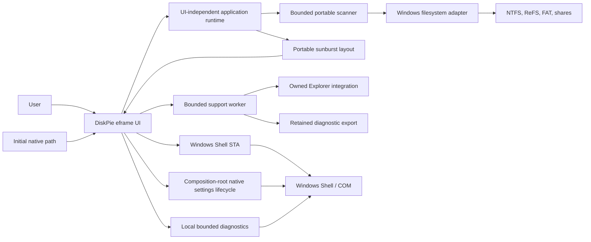
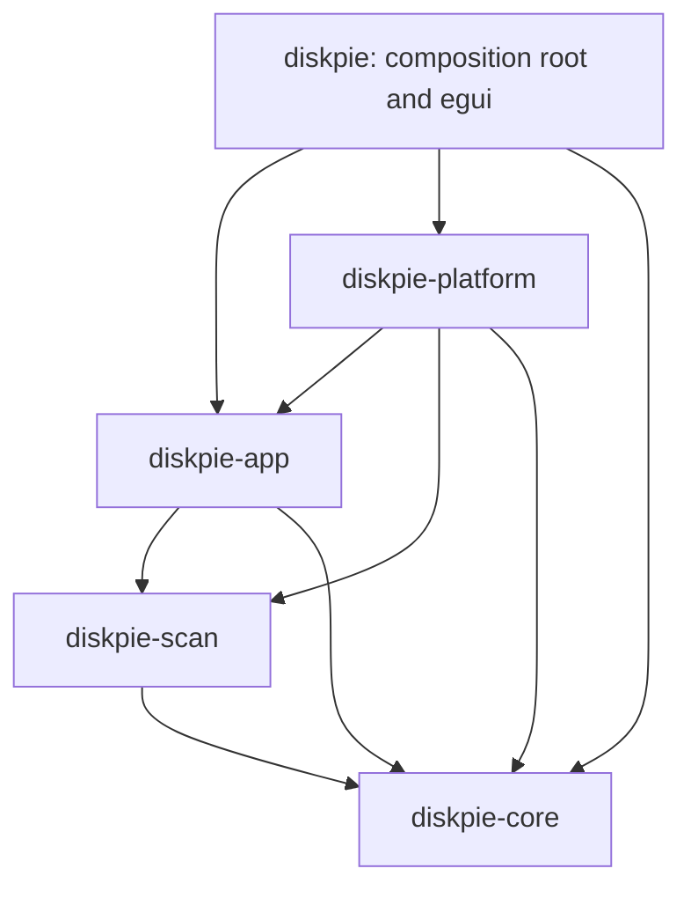
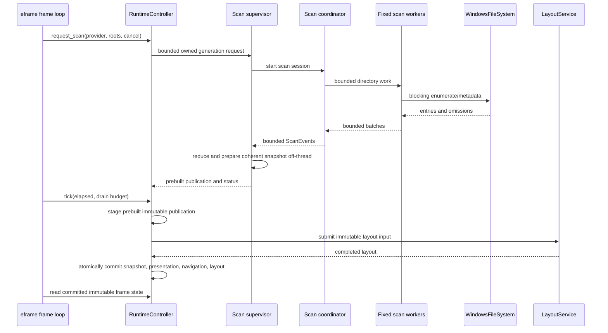
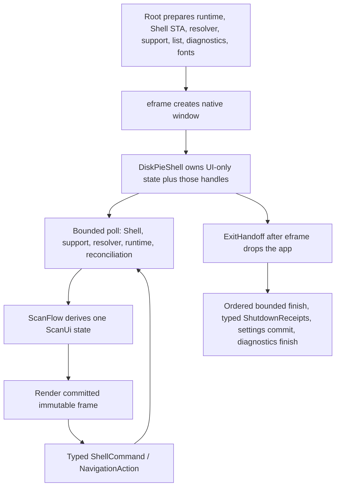
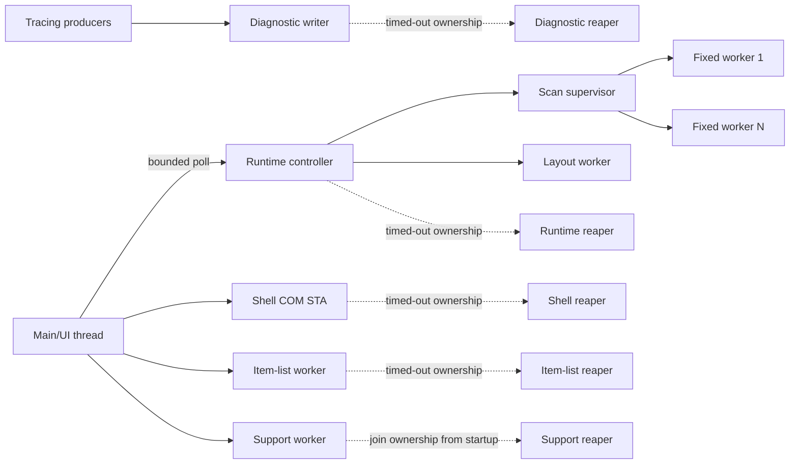

# DiskPie architecture

> Living architecture guide and continuation context. Last reconciled with the
> implementation on 2026-09-07. See ROADMAP.md and
> [redesign validation](research/scanner-renovado-validation.md) for automated
> and manual evidence; connected behavior is not a claim of release readiness.

The [review remediation record](research/review-remediation-validation.md)
describes the latest changes and separates them from historical redesign evidence.

## 1. Architectural goals

DiskPie must scan very large directory trees without freezing the UI, preserve
Windows-native path identity, stream coherent partial results, cancel promptly,
render a navigable sunburst, and isolate destructive Windows operations behind
explicit confirmation. The first distribution target is a portable Windows
10/11 x86-64 executable that runs as a standard user.

The design optimizes for explicit bounded ownership rather than an async
runtime, task-per-file traversal, UI-owned I/O, or a broad framework. Every
queue, worker set, retained diagnostic, history, and background retirement path
must have a documented bound.

## 2. System context



Core rule: arrows from the UI to platform services represent nonblocking
submission or composition-root lifecycle calls. The egui callback never waits
for filesystem, COM, layout, settings, diagnostics, or provider teardown.

## 3. Workspace dependency graph

The workspace is an acyclic modular monolith:



No reverse dependency is permitted without a superseding ADR.

### `diskpie-core`

Portable, UI-independent domain code:

- checked compact `NodeId` values and immutable `TreeSnapshot` revisions;
- native component names and lazy full-path reconstruction;
- logical and allocated metric types, unknown reasons, and aggregation;
- hard-link accounting inputs and file identity;
- deterministic sunburst sectors, synthetic `Other`/hidden sectors, layout, and
  polar hit testing.

It must not depend on egui, eframe, Windows APIs, or filesystem traversal.

Primary files: `crates/diskpie-core/src/model.rs` and
`crates/diskpie-core/src/sunburst.rs`.

### `diskpie-scan`

Portable blocking-scan orchestration:

- `ScanFs` is the narrow filesystem-consumer trait;
- `ScanRoot` carries a native root path, volume key, and storage class;
- one coordinator owns pending directories, ordering, permits, and progress;
- a fixed worker set receives capacity-one work items;
- bounded result and event channels provide backpressure;
- `CancelToken` and scan generations reject stale work;
- batches stream partial results and typed omissions.

The scanner never creates one task per file and never mutates UI state.

Primary files: `crates/diskpie-scan/src/fs.rs`, `protocol.rs`, and
`coordinator.rs`.

### `diskpie-app`

UI-independent application policy and orchestration:

- `SessionReducer` applies scan events and publishes coherent snapshots;
- `RuntimeController` owns active/pending/retiring scans and frame-bounded
  polling;
- `LayoutService` computes layouts off the frame thread;
- `ItemListService` ranks and filters all immediate children off-thread;
- branch replacement merges and re-aggregates an immutable snapshot after join;
- `NavigationState` owns selection, zoom root, Back history, hidden branches,
  size basis, and rescan intent;
- presentation indexes provide stable textual/chart-facing state;
- settings policy parses, migrates, validates, stages, and reports bounded RON;
- diagnostics define typed path-free events, redaction, and bounded export;
- `actions` validates real targets, runs the pure ADR 0008 confirmation flow,
  issues single-use capabilities, and defines the destructive result model.

This crate may own traits implemented by the platform, but it must not name COM,
Win32, HWND, egui, or eframe types.

Primary files: `runtime.rs`, `session.rs`, `navigation.rs`, `actions.rs`,
`layout_service.rs`, `presentation.rs`, `settings.rs`, and `diagnostics/`.

### `diskpie-platform`

Target-gated operating-system adapters and the only normal home for
project-authored unsafe code:

- `filesystem.rs`: Win32 directory enumeration and metadata;
- `volumes.rs`: volume discovery, device hints, capacity, and root resolution;
- `shell_service.rs`: one message-pumping COM STA, its bounded request queue,
  folder/Save As dialogs, and per-request cancellation;
- `shell_actions.rs`: open/reveal/Installed Apps, `IFileOperation` recycle and
  permanent deletion with a progress sink, late identity validation, and the
  Recycle Bin query/empty calls;
- `project_paths.rs`: Known Folder-based application directories;
- `diagnostic_files.rs`: retained-handle local logging, retention, export, and
  atomic marker support; and
- `settings_file.rs`: explicit retained-handle `app.ron` transport.

Every unsafe block must be target-gated, minimal, documented with a `SAFETY`
invariant, and convert raw ownership to RAII immediately.

### `diskpie`

Executable and composition root:

- CLI parsing and native startup path;
- eframe lifecycle and dependency construction;
- responsive UI, theme, localization, and chart mesh adapter;
- polling platform/runtime events within frame budgets;
- local diagnostic subscriber lifecycle;
- settings/crash capability preparation and post-event-loop finish; and
- destructive confirmation, post-action reconciliation, Explorer preferences,
  and diagnostic preview/destination surfaces;
- `support_service.rs`: a UI-independent composition worker for target validation,
  registry operations, bounded diagnostic collection, and export capabilities.

The crate forbids unsafe code. Native filesystem and COM work belongs in the
platform crate.

## 4. Scan-to-frame data flow



Important invariants:

- Only the coordinator schedules directory work.
- Workers never recursively enqueue more workers.
- Every event carries a generation; stale events cannot mutate a newer scan.
- The frame loop uses `try_recv`/bounded drains and never waits.
- A new snapshot is visible only when snapshot, presentation, navigation, and
  layout correspond to the same committed revision.
- Progressive snapshots are rate-limited so layout cannot starve scanning or
  repaint continuously while idle.

## 5. Runtime ownership model

`RuntimeController` is the application-level owner of scan lifecycle:

- `Idle`: no active or settled session;
- `Active`: one generation is reducing events;
- `Cancelling`: the active generation is invalidated and an optional one-slot
  replacement is pending;
- `Settled`: terminal results and summary remain inspectable;
- `ShuttingDown`: cancellation and retirement have begun; and
- `ShutdownComplete`: runtime ownership has been handed off, although an
  underlying provider may still be returning from a blocking OS call.

Rejected launches preserve ownership. Callers recover the exact provider,
roots, and token from `ScanLaunchRejected::into_parts`; rejection must never
silently consume or leak them.

Retirement uses a process-wide bounded reaper. Its intended accounting is:

```text
available ordinary slots + active disposal + queued payloads + reserved teardown slot = 65
```

There are at most 64 ordinary retiring payloads. The 65th slot is reserved for
runtime teardown so dropping the application remains bounded even under
ordinary retirement saturation. Capacity remains occupied until disposal has
actually returned, including through a caught panic.

Focused stress and ownership tests cover retirement. Current integrated gate
results and remaining manual evidence are recorded in ROADMAP.md.

Branch rescans retain a settled `BranchRescanIntent` containing the exact
snapshot, generation, revision, node, and native path. The supervisor waits for
the branch coordinator's actual join before merging. It rebuilds and
re-aggregates the full tree off-thread and only publishes a successful terminal
replacement; cancellation or failure retains the prior committed frame. This
cost is O(total nodes), not a constant-memory splice. Stale intents cannot
replace another committed revision. ADR 0020 records the composition contract.
The cancellation token survives join and preparation. Final publication and
cancellation acceptance share the same short mutex-protected decision; rejected
publications are disposed off-thread. Merge, freezing and presentation indexing
check cancellation between batches. Provider failures retain their error phase.

## 6. Model and filesystem semantics

### Native paths

Filesystem identity uses `Path`, `PathBuf`, `OsStr`, and `OsString`. Display may
be lossy and escaped, but a display string must never be converted back into an
action path. Windows adapters convert absolute DOS/UNC paths to extended-length
forms and preserve non-scalar UTF-16 where APIs allow it.

### Size model

Each node distinguishes:

- logical size (end-of-file content length);
- allocated size (storage actually allocated by the filesystem);
- source/precision; and
- unknown reason.

Unknown is not zero. UI proportions use the selected size basis; details show
both. Totals use checked wide accumulation before any display conversion.

### Hard links

Hard-link deduplication is scoped to a volume and based on stable file identity.
The first observed identity contributes allocation according to ADR 0002;
subsequent links do not double-count allocated storage. Logical naming remains
visible for each directory entry. When identity is unavailable, precision is
reported rather than silently claiming exact deduplication.

Nodes retain observed allocation separately from deduplicated ownership. Branch
replacement can therefore transfer allocation to a surviving alias outside the
rescanned branch without losing the original observation.

### Boundaries and omissions

By default, DiskPie does not traverse reparse points, symlinks, junctions,
mount points, or cloud boundaries that could loop, escape the selected tree,
cross a volume, or hydrate content. The adapter returns a visible omission or
boundary record. Access denied and isolated I/O failures also become omissions;
they do not abort unrelated branches.

Directories remain incomplete until their enumeration terminates. Cancellation
does not turn queued or unfinished descendants into complete zero-byte folders.
Root-resolution failures in a multi-root request are surfaced as omissions while
valid roots continue.
The resolver also retains the full normalized native selection. Composition
keeps it independently of observed nodes through deferred launches and branch
rescans, so F5 retries every requested root even when a prior resolution failed.
An accepted full launch stages that scope by generation. It becomes the current
scope only when that generation's first snapshot is displayed; cancelling a
still-unshown launch cannot replace the roots of the retained visible results.

Sparse and compressed allocation is read from filesystem metadata. Remote,
removable, and unknown devices use conservative scheduling classes.

## 7. Navigation and presentation

`NavigationState` is pure and generation-sealed. It separates:

- the chart's current `view_root`;
- the selected real node;
- bounded Back history;
- size basis;
- explicitly hidden branches; and
- rescan requests.

Commands are typed (`Select`, `Activate`, `Zoom`, `Back`, `Parent`,
`ShowSummary`, hide/restore, size-basis change, full/branch rescan). Availability
is computed before execution and stale-generation commands fail without partial
mutation.

When a progressive or rescan snapshot replaces the current one, anchors resolve
by file identity first, exact native path second, and deepest surviving real
ancestor where appropriate. Hidden deleted children do not cause an ancestor to
be hidden accidentally.

Hidden-branch edits use a persistent plan with a strict maximum delta depth of
64. Lookups visit at most 65 nodes. A caller-frame rebase swaps to a cached base
in O(1); if the cache is not ready, mutation returns `HiddenStateBusy` rather
than materializing an unbounded set on the UI thread.

`SnapshotPresentation` derives its native-path hashes and color-family index in
one pass. The family index stores `family_anchor: NodeId` and
`depth_in_family: u32` (8 bytes per node). Each direct child of a scanned
`EntryKind::Root` starts a family; descendants inherit that anchor and absolute
family depth. `ColorIdentity { family_key, variant_key, depth }` is retrieved in
O(1), reusing the existing `path_color_keys`. Stable native paths retain their
color identity across metric changes, reordering, zoom and branch replacement;
the renderer chooses the actual palette.

UI context-menu targets and row IDs carry the displayed generation and revision.
Deferred navigation retains the original `NavigationCommand` and revision and
is discarded when either becomes stale; a retry never rebinds an old `NodeId`
to a new generation. Logical keyboard focus may persist across append-only
progressive revisions, but it resets to remapped selection on a new generation.

## 8. Sunburst architecture

The portable layout engine produces immutable backend-neutral sectors. Sectors
may represent:

- a real actionable node;
- a synthetic multi-root summary;
- aggregated `Other` children; or
- aggregated hidden members.

Only a real sector exposes an action target. Synthetic sectors cannot be used
for filesystem mutations.

Snapshot aggregation computes positive descendant depth per metric before any
hidden-branch, minimum-angle or sector-budget grouping. On x64 its field fits
existing aggregate padding. Layout reads that depth and applies the configured
ceiling (default eight) in O(1). A 0.28 center radius and the effective depth
distribute rings over the remaining radius; zero depth uses a neutral full disk.
A tiny deep branch can reserve rings even when grouped, so hiding or changing
the budget alone cannot rescale the chart. Stable index merges, grouping and
member copying check cancellation; discarded allocations still take worker time.
Snapshot root indexes make RescanAll availability O(number of roots).

`crates/diskpie/src/sunburst_view.rs` converts a committed layout into cached
egui meshes, performs pointer/keyboard interaction mapping, and returns typed
requests to application state. Mesh identity includes geometry and the full
color identity; hover, focus and selection remain independent overlays and do
not rebuild the base mesh. The optional synchronized textual list provides
keyboard-accessible equivalents without permanently reducing the map area.

The chart's sector limit never limits the list's reachable children.
`ItemListService` keeps one running request, one coalesced pending request, and
one completion. `ItemListKey` identifies generation, revision, root, size basis,
query, `ItemSort::{Name, Size}` and `SortDirection::{Ascending, Descending}`.
The default is Size descending. Name matching and primary name ordering ignore
case, with exact native names and `NodeId` as deterministic final tie-breakers.
Changing only the query reuses ranking; changing sort or direction invalidates
that ranking. The worker and `ranked_position` share the comparator, allowing
O(log n) selected-row lookup even in a filtered index. The UI accepts only a
matching result and virtualizes rows. List and layout loops check cancellation
during expensive work; their worker lifecycle includes explicit join evidence.

## 9. UI composition

`DiskPieShell` implements the Scanner renovado direction in ADR 0021: a large
map with a compact toolbar, a footer and an optional list with collapsible
details. It preserves theme/locale controls, settings synchronization and the
real service handles the composition root prepares before the window exists:



Composition-root modules in `crates/diskpie/src`:

- `scan_ui.rs`: the headless state machine. `ScanFlow` accumulates plain
  observations (dialog outstanding, resolver jobs, deferred launch, runtime
  state, whether the committed snapshot belongs to the current generation) and
  derives exactly one `ScanUi` state: `Empty`, `Choosing`, `Resolving`,
  `Scanning`, `Partial { settled }`, `Cancelling`, `Complete`,
  `CancelledWithResults`, or `Failed { class }`. `repaint_policy` is pure: an
  idle frame requests no repaint; outstanding Shell/resolver work polls again
  after a short delay; a busy runtime repaints continuously. A folder dialog
  that is dismissed or fails is a picker outcome, not a scan outcome: the flow
  returns to the state it had before the dialog opened (earlier results
  included) and only the status line and the `shell.action_failed` record,
  classed by the adapter's typed failure stage, say what happened. A launch
  refused for retirement backpressure is retried on later frames with the
  exact provider, roots, and cancel token the runtime handed back; a spent
  retry budget is reported as `Failed { class: Busy }`, never as an internal
  error.
- `resolver.rs`: one root-owned worker thread behind a `ResolveBackend` trait.
  It canonicalizes `.`/`..` lexically after `std::path::absolute`, calls
  `resolve_scan_root`, enumerates volumes with `discover_volumes`, and builds
  the `WindowsFileSystem` with the scan's cancel token. The frame side submits
  bounded jobs (`try_send`) and drains bounded results; the root joins the
  worker with a deadline after the event loop.
- `diagnostic_sink.rs`: a bounded `SyncSender<DiagnosticEvent>` clone for the
  shell (drop-and-count when full) drained by a root-owned thread into the
  installed tracing subscriber. Events carry only the typed fields; never paths.
- `fonts.rs`: reads well-known Windows fonts at startup (bounded to 64 MiB,
  missing files skipped). Segoe UI becomes the primary proportional face when
  present; embedded faces and multilingual fallbacks remain. System fonts are
  read locally and are not redistributed.
- `support_service.rs`: one bounded worker for target validation, Explorer
  registry inspection/mutation, log collection, and prepared diagnostic export.
  Admission includes queued and undrained jobs (maximum four). A precreated
  reaper owns its thread handle from startup; timed-out ownership prevents a
  replacement until actual join. A failed handoff retains one process-lifetime
  quarantine and cannot supply a clean shutdown receipt.
- `shell/actions_ui.rs`: confirmation state, accepted request obligations,
  result receipts, stale-result gating, and post-action branch/full/bin refresh.
- `shell/support_ui.rs`: asynchronous integration state and exact diagnostic
  preview pages, per-export path consent, destination tokens, and save results.

The shell obtains the owner HWND through eframe's `HasWindowHandle` on
`eframe::Frame` and hands the integer to `OwnerWindow::from_raw`; it owns no
COM object. Callbacks submit typed requests, cancel, and poll without waiting.
Every navigation action goes through
`RuntimeController::navigation_command` and `execute_navigation`;
`NavigationReport::rescan_request` is consumed by resolving the full roots
again through the resolver or preparing a settled branch intent. Shell-wide shortcuts yield to a
focused text field and Escape yields to an open popup; modifiers must match
exactly. When the window closes while a generation is still active or
cancelling, the shell writes that generation's `scan.cancelled` record with the
counters observed at that moment before requesting runtime shutdown, because
no later frame will drain the terminal report.

Surfaces:

- toolbar: 40 points high, with navigation, folder/drive selection, location,
  rescan/cancel, active metric, Show list and Tools; availability controls the
  enabled state and localized disabled explanation;
- radial lens: the default workspace, with folder/drive selection before a
  result exists and the committed `SunburstView` afterwards. Its center always
  describes `view_root`, including the active metric and incomplete/unknown
  size. Earlier results stay visible during resolution and branch rescanning;
- optional list: resizable 260–400 points, initially 300, with search, Name/Size
  sorting, aligned size/percentage columns and 30-point virtualized rows
  (`ScrollArea::show_rows`). Details and current-item actions are collapsible.
  Below 800 points Show list switches between map and list while preserving the
  saved preference;
- Tools: appearance/language and Explorer preferences, diagnostics, Recycle Bin
  and Installed Apps; chart/list context menus keep item and branch actions;
- footer: 28 points high, showing hover or keyboard-focus information, counts,
  progress and notices, including omissions, hidden items and pending updates.

Keyboard: Backspace and Alt+Left go back, Alt+Up goes to the parent, F5
rescans, Esc cancels while a scan is active, Ctrl+O opens the folder picker;
the chart keeps its own arrow/Enter/Space/Escape/Shift+F10 handling. In chart and
list, a click enters a real folder or selects a file without opening it; a
recognized second click does not activate newly zoomed content. The chart center
goes to the parent. Enter activates and Space selects; list Up/Down reaches all
filtered rows, including rows outside the virtualized viewport. Shift+F10 opens
the same context menu from keyboard focus. Text fields retain their own keys.

Shutdown: the shell calls `RuntimeController::request_shutdown`,
`ShellService::request_shutdown`, and the resolver stop flag when the viewport
close is requested (and again in `on_exit`/`Drop`); after `run_native`
returns, `main.rs` awaits the runtime handoff, drops the runtime, calls
`ShellService::finish(2 s)`, joins the resolver and the diagnostic bridge with
deadlines, finishes the list and support workers, and returns typed `ShutdownReceipts` for the panic-marker
quiescence proof, then publishes settings and finishes diagnostics.

The actual previous-session panic state is passed to the shell. New native visual
and accessibility acceptance is tracked separately from the headless UI tests.

See [UI product direction](research/ui-product-direction.md) for typography,
palette, accessibility, motion and frame-performance constraints, and
[redesign validation](research/scanner-renovado-validation.md) for the recorded
automated, native and performance evidence.

## 10. Windows platform services

### Filesystem and volumes

`WindowsFileSystem` uses direct Win32 enumeration and metadata calls. It has
optional direct cancellation checkpoints and is passed the same token used by
the scan coordinator. `resolve_scan_root` turns a selected absolute path into a
portable `ScanRoot` plus volume/device evidence. This resolution is blocking and
must not run in an egui callback.
Enumeration and relative child metadata opens share one retained directory
handle; native name resolution rejects reparse redirection. A bounded 64 KiB
directory buffer uses extended records or a full-record provider fallback on
that same handle. Per-file attributes, allocation and full identity remain
verified independently. ADR 0022 records the added API feature and provider limits.

### Shell STA

`ShellService` owns one dedicated, message-pumping single-threaded COM
apartment. Requests/events crossing the channel are owned plain data; COM
interfaces and PIDLs never leave the STA. The current implementation supports a
filesystem-only folder and Save As dialogs with a real owner HWND and one
outstanding modal request, plus the action requests described below.

Shutdown is bounded (ADR 0007, decision note 2026-09-03). `request_shutdown`
is nonblocking and idempotent; `finish(timeout)` is the composition root's
explicit completion point outside the UI loop and returns a typed
`ShellServiceFinish`; `Drop` does atomic/`Arc` work only and never joins. A
worker that outlives the deadline is handed, with its singleton claim, to one
precreated process-wide reaper thread with a fixed queue of
`SHELL_REAPER_CAPACITY` entries; the reaper joins before releasing the claim,
so a second STA cannot start until the old one truly exited. If that hand-off
is impossible the lifecycle fails closed and the claim stays held for the rest
of the process.

### Destructive actions

Open, reveal, Installed Apps, the advisory Recycle Bin query, recycle,
permanent delete, and empty-bin requests extend the same STA (ADR 0008,
implementation note 2026-09-04).

The UI composes these contracts without running native work in a callback:

- `diskpie_app::actions::TargetValidator` turns a real, current `NodeId` into a
  `FilesystemTarget` that records the purpose it was validated for; synthetic,
  stale, and hidden nodes are rejected for every purpose, and
  drive/volume/share-root, scan-root, running-executable, and
  executable-containing nodes are rejected for destructive validation before
  any dialog appears. `ConfirmationFlow` refuses to start a recycle or delete
  from a target validated only for open or reveal.
- `ConfirmationFlow` is the pure state machine (`Idle -> Reviewing ->
  Confirmed` for recycling; `Idle -> Reviewing -> AwaitingWord ->
  StronglyConfirmed` with the typed `DELETE`/`EMPTY` word otherwise). It
  issues `Confirmed<RecycleRequest>`, `StronglyConfirmed<DeleteRequest>`, and
  `StronglyConfirmed<EmptyRecycleBinRequest>`: private constructors, no
  `Clone`, bound to kind, exact path or scope, generation, target kind, and
  file identity. Consuming one yields the request and a `PendingObligation`
  (`RescanParent`/`RescanAll`/`RescanRecycleBin`) the runtime must settle after
  every attempt.
- `ShellRequest::recycle`, `delete_permanently`, and `empty_recycle_bin` are the
  only way to build a destructive Shell request, and they take the capability
  by value. `ShellService::cancel(id)` skips a queued request reliably and is
  honoured cooperatively in `PreDeleteItem`.
- The STA refuses scan/drive roots and mode-mismatched payloads outright,
  revalidates `(volume, FILE_ID_128)` through a no-follow handle immediately
  before `DeleteItem` (`TargetChanged` on mismatch; `KindOnly` assurance when
  the scanner captured no identity, as for directories), runs one
  `IFileOperation` per request with explicit flags and a recording progress
  sink, re-inspects the exact path afterwards so a skipped item is never
  reported as removed, and classifies the evidence into `Completed`,
  `CancelledBeforeMutation`, `Partial`, `Failed`, `UnknownMayHaveMutated`,
  `SafetyViolationUnexpectedPermanentDelete`, or `TargetChanged`.
- Open/reveal/Installed Apps report `Dispatched` or a typed failure stage; the
  raw calls sit behind a small internal seam so marshalling is tested without
  launching anything.

The connected confirmation UI focuses Cancel initially, presents exact and
escaped native paths, requires the stronger typed words, revalidates after
confirmation, and settles a refresh obligation for every attempt. Recycle is
enabled only for proven fixed local NTFS; missing identity is disclosed as lower
assurance. Result uncertainty keeps data stale, and unexpected permanent deletion
halts later destructive requests. The root retains pending obligations at shutdown.

The disposable-VM provider matrix (FAT/removable, SMB, disabled/full bin,
oversized items, read-only/open/ACL-denied targets) remains necessary before
broadening Recycle support. Real Empty Recycle Bin is never executed against
the user's bin during routine validation. Native UI and directory callback
evidence must be recorded separately from ordinary fake-port tests.

### Explorer integration

Optional integration is per-user, reversible, and idempotent. DiskPie owns only
its registry keys, does not elevate, and never overwrites foreign/conflicting
values. See ADR 0009.

`diskpie_app::explorer_integration` owns the exact key layout, `REG_SZ` value
set, direct command template, ownership classification
(`NotInstalled`/`OwnedCurrent`/`OwnedStale`/`Foreign`/`Ambiguous`), the
install/repair/remove decision table, and the staged commit with rollback
behind the `IntegrationRegistry` port. `diskpie_platform::WindowsIntegrationRegistry`
implements the port over `windows-registry` below an injectable
`HKEY_CURRENT_USER` root (`Software\Classes` in production, a unique
`Software\DiskPieTest\<run id>\Classes` subtree in tests) and issues
`SHChangeNotify(SHCNE_ASSOCCHANGED)` after mutations. The composition root
supplies `std::env::current_exe()`; Tools preferences render the actual
`ExplorerIntegrationStatus` and submit inspect/install/repair/remove through the
support worker. Every attempt retains operation and post-inspection results
separately, including partially failed removal. Known/potential modifications
notify Explorer. Failed inspection invalidates verified UI/preference state;
partial owned installations expose safe completion through the domain table.

## 11. Settings, diagnostics, and panic recovery

### Settings policy

`SettingsSession` and `SettingsDocumentStore` separate pure settings policy from
native bytes. The schema is versioned and bounded; malformed or future-version
documents fall back predictably while retaining a warning. Eframe persistence
is compile-time disabled.

The version-1 payload uses additive defaults: `show_item_list = false` and
`item_list_width_points = 300`, with width validated to 260–400 points. Existing
documents retain theme, locale, metric and other preferences; default theme is
System and default size basis is Allocated. Sort, query, hover, selection and
navigation history remain transient. The optional list and appearance controls
stage explicit edits through the existing `SettingsSession` lifecycle.

`main.rs` prepares `WindowsSettingsFile` before the window, loads the bounded
document, and commits staged `app.ron` bytes after the event loop. Retained local
parent/target handles and native identity evidence implement ADR 0019; unavailable
storage is visible and never falls back to the executable directory.

### Diagnostics

The app layer defines typed stable diagnostic codes/fields, redaction, and
bounded export. The executable's `LocalDiagnostics` installs a tracing
subscriber backed by bounded queues. Windows diagnostic files retain safe local
directory/file capabilities and enforce retention/export limits.

Accepted lifecycle rules:

- `Drop` performs atomic/Arc operations only;
- explicit `finish` has a 250 ms bound;
- the subscriber holds a weak queue owner;
- a process-wide singleton reaper has bounded registrations;
- reaper failure terminalizes future startup rather than multiplying orphans;
  and
- startup retention reports a truthful bounded outcome.

Export schema 2 reports the last settled scan, not cumulative counters. Fields
without measurements are explicitly unknown. The compositor retains a bounded
suffix and header-margin metadata; collection seeks to each verified source's
initial bounded tail, reading at most 1 MiB rather than its complete daily log.

Interactive export builds an immutable artifact in the support worker, previews
exact paginated bytes, and resets path consent for each export. The STA's native
Save As suggests a UTC-dated `.txt` name. Preflight retains parent/target handles
and identifies actual local/network transport before user confirmation; the UI
holds only a single-use token. No temporary file exists before commit.

`PreparedDiagnosticExport::commit` refuses any existing destination and publishes
the verified temporary by parent-relative no-replace rename. A late alias cannot
be overwritten. The eager legacy writer keeps replacement compatibility but is
never called by this UI. ADR 0020 records this refinement of ADR 0016, including
the explicit residual interval in the legacy writer. Managed source files are
protected by exact name/identity; collection keeps at most eight bounded newest
log tails and never modifies source logs. No export uploads data.

### Panic marker

`panic_marker.rs` owns the pure capability/session contract and is declared
from `main.rs`. On Windows the composition root installs `CrashRuntime` after
the crash directory is created and before the native window exists; the hook
is backed by `diskpie_platform::WindowsMarkerSession`, a retained-handle
adapter that mirrors the settings transport.

The wired lifecycle is:

1. `WindowsMarkerSession::prepare` retains the local non-reparse crash
   directory handle, inspects `last-panic.txt` and the fixed sibling
   `last-panic.write` as regular single-link direct children, reads each
   present slot with a 4 KiB ASCII bound, and precomputes the sibling path
   plus the replace/create/recovery `FileRenameInformationEx` buffers. A
   directory, reparse point, hard-linked, oversized, or non-ASCII slot is
   reported unavailable and is never touched afterwards.
2. The hook is installed with only prebuilt bounded marker variants and the
   sealed capability; no path survives preparation.
3. On panic, `commit` creates the exclusive sibling from the precomputed path,
   writes, flushes, and verifies it through its own handle, revalidates the
   target identity through the retained parent, renames by handle, and
   classifies `Committed`, `NotCommitted`, or `CommittedButUnverified` from
   post-operation identities. It never allocates, locks, or reopens a path.
4. An uncaught crash leaves the marker for the next launch, where its presence
   is recorded as `panic.marker_found` without any inferred cause.
5. A caught panic followed by a clean shutdown restores or removes only the
   marker whose native identity and session token still belong to this
   session (`OwnershipReconciliation::AtomicFileIdentity`). The check runs on
   a handle that denies delete sharing; removal is applied to that pinned
   object, and restoration renames the verified sibling over it immediately
   after the pin is released (ADR 0017 records the single-call residual).
   Any uncertainty preserves every copy.
6. Reconciliation consumes `ShutdownQuiescenceProof::from_receipts`, which
   requires the `DiagnosticsQuiescenceReceipt` that only
   `LocalDiagnostics::finish` mints from the worker's completion message,
   plus actual runtime, Shell, resolver, bridge, item-list, and support join
   evidence from the composition root. A deadline handoff or quarantined worker
   is not a joined receipt and cannot mint the clean-shutdown proof.
   Without a proof the runtime is dropped and the marker is preserved.
   A startup failure can occur after composing some workers; missing UI receipts
   therefore cannot mint a no-runtime or clean-shutdown capability.

Explicit preview and delete reuse the same session type through
`preview_marker` and `delete_marker`; deletion goes only through freshly
inspected handles whose identities still match, so a swapped file is
preserved and reported.

## 12. Process and thread ownership



No component may create an unbounded number of workers or a new helper thread
from every `Drop`. Explicit composition-root finish methods may wait only within
documented deadlines and never while holding shared mutexes. A timed-out owned
provider is transferred to one bounded process-wide reaper or the subsystem
fails closed.

## 13. Privacy and security boundaries

- Diagnostic values use typed fields; arbitrary user paths are not accepted as
  diagnostic strings.
- `Debug` implementations for path-bearing requests/results redact paths.
- Settings, logs, and marker targets must be direct local non-reparse children
  of retained application-owned directories. Export uses the user's retained
  destination parent, discloses actual network transport, and forbids replacing
  any existing destination in the interactive workflow.
- Atomic replacement is classified through source/target identity after every
  native call, including failure returns.
- Cleanup deletes only a sibling proven to be owned by its retained handle.
- The application scans and operates normally without administrator rights.
- Destructive tests are restricted to self-created temporary fixtures.
- User-controlled paths are never concatenated into command-interpreter input.

## 14. Testing architecture

The release gate combines:

- pure unit tests for model, aggregation, layout, navigation, settings, event
  contracts, redaction, and confirmation policy;
- integration tests for scan generations, progressive publication,
  cancellation, backpressure, and ownership return;
- property tests for tree/layout invariants and hit testing;
- Windows-only NTFS fixtures for long/native names, file identity, hard links,
  sparse/compressed files, reparse loops, permissions, retained-handle races,
  Shell STA ownership, and native settings/actions;
- headless UI state tests and manual Windows 10/11 accessibility/DPI/theme
  smoke checks;
- reproducible performance benchmarks; and
- locked dependency advisory/license audits.

The full standard local gate is:

```powershell
cargo fmt --all -- --check
cargo clippy --workspace --all-targets --all-features --locked -- -D warnings
cargo test --workspace --all-features --locked
cargo test --workspace --doc --locked
git diff --check
```

See ROADMAP.md for delivery history and
[Scanner renovado validation](research/scanner-renovado-validation.md) for the
redesign's exact checks, captures and benchmark evidence.
Native visual checks, accessibility, clean VMs, and actual empty-bin behavior
remain separate acceptance items.

## 15. Current gaps and next architectural decisions

1. Complete integrated automated and manual acceptance of the connected flows.
2. Record repeatable throughput, memory, first-result, cancellation, layout, and
   list measurements. Whole-tree branch merging remains a memory/cost target.
3. Keep the isolated batch-enumeration prototype out of production until provider
   semantics and repeatable measurements justify adoption; no MFT backend is
   selected by this work.
4. In a separately authorized phase, verify portable packaging on clean Windows
   10/11 machines and prepare/publicize the stable release.

Use [ROADMAP.md](../ROADMAP.md) for evidence, remaining work, and release scope.
