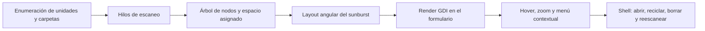
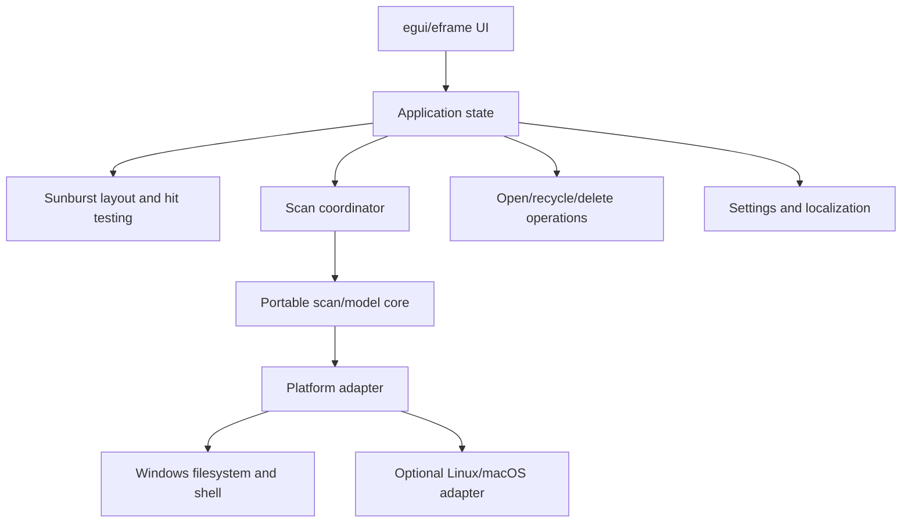

# Scanner 2.13: análisis y plan de modernización

Fecha del análisis: 2026-08-02  
Carpeta analizada: `C:\Users\Luis\Desktop\scan`  
Objetivo futuro: construir **DiskPie**, una reimplementación limpia en Rust + egui.

## 1. Resumen ejecutivo

Scanner 2.13 es una utilidad Win32 x86 escrita con Delphi/VCL clásico. Presenta el uso del disco como un gráfico sunburst, permite navegar por carpetas y ofrece operaciones del shell como abrir, reciclar, borrar y reescanear.

La descarga pública no contiene código fuente. Sólo incluye un ejecutable compilado, traducciones, manuales y archivos de registro para integrar la aplicación con Explorer. El ejecutable no está empaquetado y conserva numerosos metadatos de Delphi, el formulario VCL completo y nombres de eventos, lo que permite reconstruir con bastante precisión su comportamiento, pero no recuperar automáticamente un proyecto Delphi mantenible.

La recomendación es una reimplementación limpia, Windows-first, en Rust + egui. El núcleo de escaneo y el modelo deben permanecer independientes de la plataforma para que Linux y macOS puedan añadirse sin comprometer la versión de Windows. La primera distribución requerida será un EXE portable para Windows 10 y 11.

## 2. Inventario del paquete original

| Archivo | Tamaño | Propósito |
|---|---:|---|
| `Scanner.exe` | 489472 bytes | Ejecutable Win32 x86 |
| `Scanner.lang` | 7476 bytes | 20 traducciones en codificaciones heredadas |
| `Scanner.en.txt` | 11700 bytes | Manual e historial en inglés |
| `Scanner.de.txt` | 12509 bytes | Manual e historial en alemán |
| `Add Scanner to Context Menu.reg` | 516 bytes | Añade comandos para unidades y carpetas |
| `Delete Scanner from Context Menu.reg` | 262 bytes | Elimina dichos comandos |

SHA-256 de `Scanner.exe`:

```text
ED2231E8F5730EF5ADCF80D2C37AB213B92C5BCEBBBB1306EBA5C6E0BC451620
```

Los archivos originales son material de referencia y **no deben incluirse en el repositorio público de DiskPie**.

## 3. Evidencia técnica del ejecutable

### 3.1 Formato y toolchain

- PE32 para x86, subsistema Windows GUI.
- Delphi/VCL clásico anterior a Unicode; probablemente pertenece a la familia Delphi 5–7, aunque la versión exacta no puede demostrarse sólo con el binario.
- Runtime VCL enlazada estáticamente.
- Dependencias limitadas a DLL del sistema: Kernel32, User32, GDI32, Advapi32, Shell32, Ole32/OleAut32, ComCtl32 y Version.
- No está comprimido ni ofuscado. La entropía de la sección de código es compatible con código nativo normal.
- No tiene overlay.
- El timestamp PE de 1992 es un artefacto del enlazador y no representa su fecha de compilación.

### 3.2 Metadatos y seguridad del PE

- No tiene firma Authenticode.
- No contiene información estándar de producto o versión; Windows informa `0.0.0.0`.
- No tiene checksum PE.
- No contiene manifiesto moderno.
- `DllCharacteristics` es cero: no declara ASLR/Dynamic Base, DEP/NX, CFG ni High-Entropy VA.
- Aunque contiene relocations, no opta por las mitigaciones modernas.
- No se ejecutó el binario durante esta auditoría; el análisis fue estático y no constituye un veredicto antimalware.

### 3.3 Compatibilidad heredada

- Usa APIs ANSI como `FindFirstFileA`, `FindNextFileA`, `CreateFileA`, `ShellExecuteA`, `SHFileOperationA` y `GetCompressedFileSizeA`.
- No es Unicode de extremo a extremo.
- No declara `longPathAware`.
- El formulario usa `ANSI_CHARSET`, `MS Sans Serif`, `Scaled=False` y borde fijo `bsSingle`.
- No es consciente del DPI y puede verse borroso o mal escalado.
- Es un proceso de 32 bits ejecutado mediante WoW64 en Windows x64.

## 4. Arquitectura reconstruida

Los recursos `PACKAGEINFO` y `TMAINFORM` muestran unidades y tipos como:

- `Main`
- `tscan`
- `VRescan`
- `TMainForm`
- `tscanthread`
- `trescanthread`

Flujo funcional inferido:



### 4.1 Escaneo

- Enumeración mediante `FindFirstFileA`/`FindNextFileA`.
- Consulta de espacio asignado mediante `GetCompressedFileSizeA`, incluyendo archivos comprimidos y sparse.
- Consulta de espacio del volumen mediante `GetDiskFreeSpaceA` y carga dinámica de `GetDiskFreeSpaceExA`.
- Hilos Win32, eventos, waits y cancelación manual.
- Escaneo paralelo de unidades basado en un ID de disco físico configurado manualmente por el usuario.
- El manual indica que no sigue carpetas que enlazan a otras carpetas o unidades.

### 4.2 Presentación

- El formulario principal contiene toolbars, botones, menús emergentes, cuatro listas de imágenes y una barra de progreso.
- El gráfico se dibuja mediante GDI (`Pie`, regiones, bitmaps y operaciones de blit).
- El coste del suavizado explica el resize discreto mediante botones `+` y `-`.
- El tamaño angular representa el espacio ocupado y los anillos exteriores representan niveles más profundos.

### 4.3 Integración con Windows

- `ShellExecuteA` para abrir rutas y enlaces.
- `SHFileOperationA` para reciclaje y borrado.
- Carga dinámica de `SHEmptyRecycleBinA`.
- Lanzamiento de `APPWIZ.CPL` para administrar aplicaciones instaladas.
- Persistencia de ajustes bajo una clave similar a `SOFTWARE\Steffen Gerlach\Scanner`.
- Los `.reg` añaden comandos bajo `HKEY_CLASSES_ROOT\Directory\shell` y `HKEY_CLASSES_ROOT\Drive\shell`.

## 5. Funciones originales que debe conservar DiskPie

1. Visualización sunburst de unidades y carpetas.
2. Tamaño proporcional al espacio utilizado.
3. Hover con ruta, tamaño y número de archivos.
4. Selección individual de unidades.
5. Resumen de varias unidades.
6. Ruta inicial por argumento de línea de comandos.
7. Navegación por zoom, carpeta superior y atrás.
8. Ocultar y mostrar ramas del gráfico.
9. Reescanear una unidad o una rama concreta.
10. Abrir un archivo o carpeta mediante el shell.
11. Enviar archivos y carpetas al papelero.
12. Eliminación permanente con confirmación inequívoca.
13. Vaciar el papelero.
14. Abrir la administración de aplicaciones de Windows.
15. Escaneo cancelable sin congelar la interfaz.
16. Escaneo paralelo de medios físicos distintos.
17. Traducciones.
18. Logging diagnóstico.
19. Integración opcional con el menú contextual de Explorer.
20. Uso portable sin instalador obligatorio.

## 6. Problemas que la reimplementación debe resolver

- Unicode completo y nombres que contienen emoji o alfabetos no latinos.
- Rutas largas y profundas.
- DPI alto, varios monitores y temas claro/oscuro.
- Junctions, symlinks y otros reparse points sin bucles.
- Hard links sin doble conteo accidental, especialmente en `WinSxS`.
- Archivos sparse y comprimidos.
- Archivos cloud/placeholders sin hidratación inesperada.
- Permisos denegados sin abortar todo el escaneo.
- Volúmenes NTFS y ReFS; red como capacidad posterior.
- Cancelación rápida y liberación determinista de recursos.
- Millones de archivos sin un objeto pesado por tarea o actualizaciones UI por archivo.
- Acciones destructivas separadas del modelo y del renderer.
- Sustitución de `SHFileOperation` por mecanismos actuales de la plataforma.
- Resultados parciales y progreso útil durante el escaneo.

## 7. Decisiones de producto

### 7.1 Nombre e identidad

- Nombre recomendado: **DiskPie**.
- Descripción: **A fast visual disk usage scanner**.
- Repositorio preferido: `diskpie`.
- Ejecutable: `diskpie.exe`.
- Si el nombre del repositorio no está disponible, usar `diskpie-rs` sin cambiar el nombre visible del producto.
- Acreditación sugerida: `Inspired by Scanner by Steffen Gerlach`.
- Crear icono, paleta, textos y recursos propios.

### 7.2 Plataforma

- Objetivo obligatorio: Windows 10 y Windows 11, x86-64.
- Primera distribución: EXE portable.
- El núcleo debe compilar sin dependencias de UI o APIs Windows.
- Linux y macOS son objetivos secundarios: se implementarán si la separación por traits/adapters lo permite sin retrasar o degradar Windows.

### 7.3 Interfaz

- Conservar el modelo espacial reconocible del original.
- Estética moderna, minimalista y propia en egui.
- Seguir el tema del sistema y ofrecer claro/oscuro.
- Ventana libremente redimensionable y DPI-aware.
- Interacción principal mediante hover, click para zoom y menú contextual.
- Accesos mediante teclado y una representación textual/lista como complemento accesible.

### 7.4 Tamaños

El usuario podrá elegir entre:

- Tamaño lógico.
- Espacio asignado/ocupado realmente en el medio.
- Ambos valores en detalles y tooltips.

El modo activo debe estar claramente indicado porque puede cambiar las proporciones del gráfico.

### 7.5 Privilegios y borrado

- La aplicación funcionará sin administrador.
- Los errores de acceso se mostrarán como elementos omitidos, no como fallos globales.
- No debe elevarse automáticamente para escanear.
- Toda acción que borre o recicle solicitará confirmación explícita.
- La eliminación permanente debe requerir una confirmación más fuerte que el reciclaje.
- Las operaciones deben mostrar el objeto exacto, permitir cancelar y reportar el resultado real.
- Las pruebas nunca deben borrar datos fuera de fixtures temporales creados por los propios tests.

### 7.6 Licencia y repositorio

- Recomendación: licencia dual `MIT OR Apache-2.0`, habitual en Rust y flexible para colaboradores y reutilización.
- Repositorio público en la cuenta personal de GitHub del usuario.
- Incluir `LICENSE-MIT`, `LICENSE-APACHE`, `README.md`, `CONTRIBUTING.md`, `CODE_OF_CONDUCT.md`, `SECURITY.md` y changelog.
- Activar issues y plantillas básicas.
- No publicar archivos originales de Scanner.

## 8. Arquitectura objetivo en Rust

La UI no debe controlar directamente el sistema de archivos.



Módulos orientativos:

```text
src/
  app/
  domain/
  scan/
  sunburst/
  platform/
    windows/
    portable/
  actions/
  settings/
  i18n/
  ui/
```

Principios:

- Árbol almacenado en arena/índices compactos, no una cascada de objetos UI.
- Paths y strings compartidos cuando aporte una reducción medible.
- Recorrido iterativo para evitar desbordar el stack.
- Paralelismo acotado por volumen y características del medio.
- Batches de resultados parciales hacia la UI.
- Cancelación mediante token/atómico comprobado frecuentemente.
- El renderer consume snapshots coherentes y nunca bloquea esperando I/O.
- Hit-testing polar independiente del dibujo.
- Colores estables derivados de identidad/ruta, con contraste comprobado.
- Orden determinista para evitar saltos visuales entre renders.
- Backend portable correcto primero; backend rápido para NTFS como optimización posterior y opcional.

## 9. Investigación y reutilización open source

El agente implementador trabajará en modo multiagente. Debe mantener subtareas de investigación en paralelo durante todo el proyecto para encontrar componentes existentes antes de desarrollar infraestructura propia.

Áreas que deben investigarse repetidamente:

- Crates de enumeración rápida y paralela de directorios.
- APIs/crates para tamaño asignado, NTFS/MFT/USN, volúmenes y reparse points.
- Cancelación, canales y estructuras de árbol/arena.
- Renderers o algoritmos sunburst compatibles con egui.
- Filelight y otros analizadores open source como referencia algorítmica.
- Integración segura con papelera y shell en Windows.
- Diálogos de archivos/carpetas, menús, accesibilidad y localización en egui.
- Persistencia de preferencias.
- Empaquetado, iconos, metadatos PE y releases portables.
- Benchmarks, fuzzing y generación de fixtures de filesystem.

Antes de integrar una dependencia, registrar:

1. Licencia compatible con `MIT OR Apache-2.0`.
2. Actividad y mantenimiento reciente.
3. Seguridad y uso de `unsafe`.
4. Soporte para Windows 10/11 y arquitecturas requeridas.
5. Impacto en tamaño y tiempo de compilación.
6. Beneficio medible frente a una implementación local pequeña.
7. Riesgo de lock-in o de abandonar la dependencia.

No usar código GPL dentro de DiskPie salvo que el usuario decida relicenciar todo el proyecto de forma compatible. Se puede estudiar comportamiento y literatura, pero no copiar código incompatible.

## 10. Estrategia de rendimiento

Métricas que deben medirse, no asumirse:

- Archivos por segundo.
- Tiempo hasta el primer resultado visible.
- Tiempo total del escaneo.
- Memoria por millón de entradas.
- Latencia de cancelación.
- Tiempo de layout y render por frame.
- Tamaño del binario portable.

Perfiles de prueba:

- Miles de archivos pequeños.
- Árbol muy profundo.
- Millones de entradas sintéticas.
- Un archivo enorme.
- Sparse, comprimidos y hard links.
- Permisos denegados.
- Junction loop.
- Unidad extraíble que desaparece.
- Share de red lento.
- Cancelación y reescaneo repetidos.

No introducir un backend MFT hasta tener un backend convencional correcto y benchmarks que justifiquen la complejidad. El backend MFT debe ser opcional y degradar limpiamente cuando no tenga permisos o el filesystem no sea NTFS.

## 11. Pruebas y calidad

- Unit tests para agregación de tamaños, orden, pruning y layout angular.
- Property tests: la suma de ángulos no supera el círculo y los hijos permanecen dentro del intervalo del padre.
- Tests de hit-testing en límites angulares y radiales.
- Integration tests con fixtures temporales.
- Tests Windows específicos para papelera y paths Unicode/largos.
- Benchmarks reproducibles para escaneo, modelo y renderer.
- `cargo fmt`, `cargo clippy` sin warnings y tests en CI.
- Auditoría periódica de dependencias y licencias.
- No aceptar dependencias o código generado sin revisar.

## 12. Distribución y GitHub

- Repositorio nuevo recomendado: `C:\Users\Luis\Desktop\scan\diskpie`.
- Mantener los seis archivos originales y este reporte en la carpeta padre.
- Copiar este reporte al repositorio como `docs/legacy-scanner-analysis.md`.
- Inicializar Git sólo dentro de `diskpie` para impedir la publicación accidental del binario original.
- GitHub Actions debe validar formato, clippy, tests y build de Windows.
- Publicar releases etiquetadas con un `diskpie.exe` portable y checksums.
- Añadir builds Linux/macOS cuando el núcleo portable esté probado; no bloquear la versión Windows por ellos.

## 13. Definición de “completo”

DiskPie se considerará completo cuando:

1. Cumpla todas las funciones originales enumeradas en la sección 5, salvo excepciones documentadas y aprobadas por el usuario.
2. Funcione como usuario estándar en Windows 10 y 11.
3. Permita elegir tamaño lógico o asignado.
4. Sea Unicode, DPI-aware y resistente a rutas largas y reparse points.
5. Escanee, cancele y reescanee sin bloquear la UI.
6. Tenga tests y benchmarks para los caminos críticos.
7. No contenga recursos ni código propietario de Scanner.
8. Tenga documentación de usuario y de contribución.
9. Exista como repositorio público con CI verde.
10. Tenga al menos una release pública con EXE portable y checksum.

## 14. Fuentes técnicas relevantes

- Manual original: `Scanner.en.txt`.
- Traducciones originales: `Scanner.lang`.
- Microsoft, rutas largas: <https://learn.microsoft.com/windows/win32/fileio/maximum-file-path-limitation>
- Microsoft, `GetCompressedFileSizeW`: <https://learn.microsoft.com/windows/win32/api/fileapi/nf-fileapi-getcompressedfilesizew>
- Microsoft, `IFileOperation`: <https://learn.microsoft.com/windows/win32/api/shobjidl_core/nn-shobjidl_core-ifileoperation>
- Microsoft, Windows App SDK deployment: <https://learn.microsoft.com/windows/apps/package-and-deploy/deploy-overview>
- KDE Filelight: <https://apps.kde.org/filelight/>
- Código de Filelight: <https://invent.kde.org/utilities/filelight>

## 15. Incertidumbres que debe resolver el agente implementador

- Nombre disponible del repositorio en la cuenta autenticada.
- Disponibilidad real de `gh` y autenticación GitHub.
- Mejor crate de UI/diálogos y su estado en el momento de implementación.
- Mejor técnica Windows para tamaño asignado sin abrir cada archivo de forma costosa.
- Semántica final de hard links en modo lógico y asignado.
- Viabilidad y permisos de un backend NTFS rápido.
- Forma soportada de integración con el menú contextual moderno de Windows 11.
- Alcance de accesibilidad que egui permita implementar de manera fiable.

Estas incertidumbres no impiden comenzar. Deben resolverse mediante prototipos, benchmarks, investigación delegada y decisiones documentadas en ADRs.
